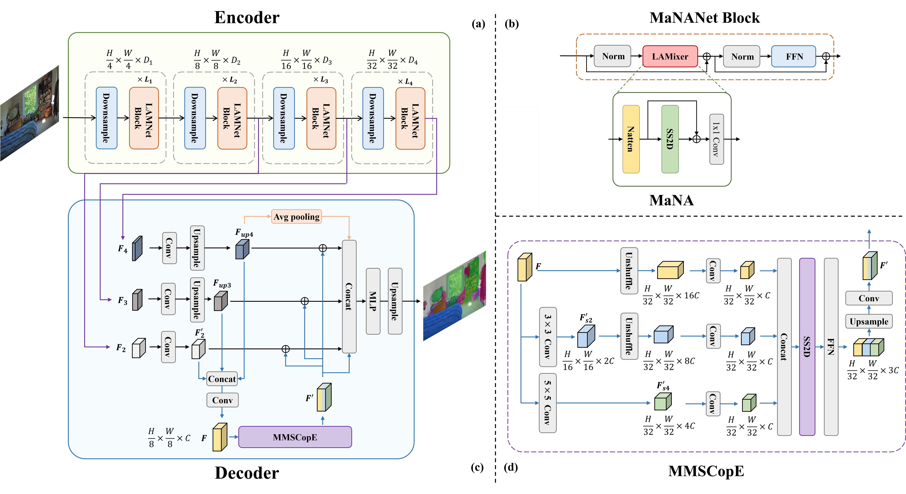
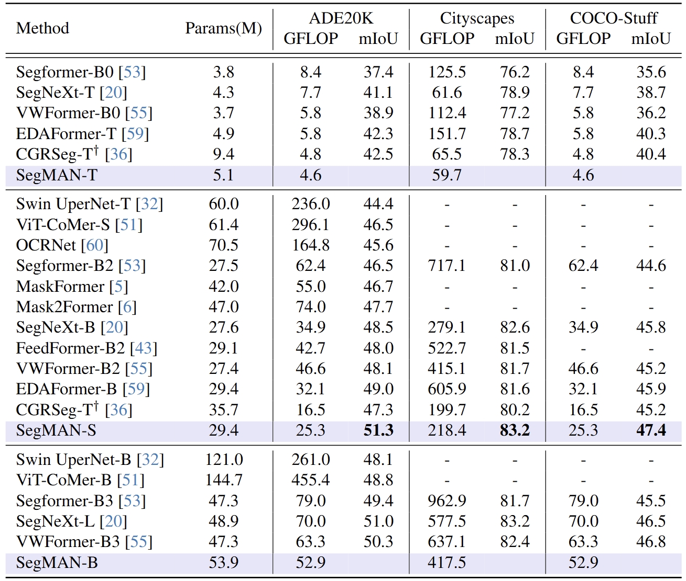

# SegMAN: Omni-scale Context Modeling with State Space Models and Local Attention for Semantic Segmentation

Official Pytorch implementation of [Omni-scale Context Modeling with State Space Models
and Local Attention for Semantic Segmentation]()



## Main Results



## Installation and data preparation

**Step 1:**  Create a new environment
```shell
conda create -n segman python=3.10
conda activate segman
```
**Step 2:** Install [MMSegmentation v0.30.0](https://github.com/open-mmlab/mmsegmentation/tree/v0.30.0) by following the [installation guidelines](https://github.com/open-mmlab/mmsegmentation/blob/v0.30.0/docs/en/get_started.md) and prepare segmentation datasets by following [data preparation](https://github.com/open-mmlab/mmsegmentation/blob/v0.30.0/docs/en/dataset_prepare.md).


**Step 3:** Install dependencies using the following commands.

To install [Natten](https://github.com/SHI-Labs/NATTEN), you should modify the following with your PyTorch and CUDA versions accordingly.
```shell
pip install natten==0.17.3+torch240cu124 -f https://shi-labs.com/natten/wheels/
```

The [Selective Scan 2D](https://github.com/MzeroMiko/VMamba) can be install with:
```shell
cd kernels/selective_scan && pip install .
```

Install other requirements:
```shell
pip install -r requirements.txt
```

## Training
Download the ImageNet-1k pretrained weights [here]() and put them in a folder ```pretrained/```. Navigate to the segmentation directory:
```shell
cd segmentation
```

Example training script for ```SegMAN-S``` on ```ADE20K```:
```shell
# Single-gpu
python tools/train.py local_configs/SegMAN/small/segman_s_512x512.ade.160k.py --work-dir outputs/EXP_NAME

# Multi-gpu
bash tools/dist_train.sh local_configs/SegMAN/small/segman_s_512x512.ade.160k.py <GPU_NUM> --work-dir outputs/EXP_NAME
```

## Evaluation
Download `trained weights` for segmentation models at [google drive](). Navigate to the segmentation directory:
```shell
cd segmentation
```

Example for evaluating ```SegMAN-S``` on ```ADE20K```:
```
# Single-gpu
python tools/test.py local_configs/SegMAN/small/segman_s_512x512.ade.160k.py /path/to/checkpoint_file

# Multi-gpu
bash tools/dist_test.sh local_configs/SegMAN/small/segman_s_512x512.ade.160k.py /path/to/checkpoint_file <GPU_NUM>
```


## Encoder Pre-training
We provide scripts for pre-training the encoder from scratch.

**Step 1:** Download [ImageNet-1k](https://www.image-net.org/download.php) and using this [script](https://gist.github.com/BIGBALLON/8a71d225eff18d88e469e6ea9b39cef4) to extract it.

**Step 2:** Start training with

```
bash scripts/train_segman-s.sh
``` 


## Acknowledgements

Our implementation is based on [MMSegmentaion](https://github.com/open-mmlab/mmsegmentation/tree/v0.24.1), [Natten](https://github.com/SHI-Labs/NATTEN), [VMamba](https://github.com/MzeroMiko/VMamba), and [SegFormer](https://github.com/NVlabs/SegFormer). We gratefully thank the authors.

## Citation
